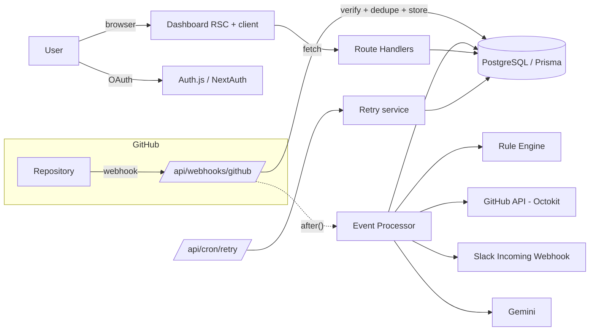

# 🤖 GitHub Automation Bot

An **event-driven GitHub automation platform**. Sign in with GitHub, connect a
repository, and the bot verifies every webhook, runs a database-backed **rule
engine**, **writes back to GitHub** (labels & comments), sends **Slack**
notifications, enriches events with **AI triage**, and shows everything on a
**live, secure dashboard**.

> Built with Next.js 15, React 19, TypeScript, Prisma, PostgreSQL, Auth.js
> (NextAuth), Tailwind CSS + shadcn/ui, Octokit and Google Gemini.

---

## Table of contents

- [Overview](#overview)
- [Features](#features)
- [Architecture](#architecture)
- [Screenshots](#screenshots)
- [Tech stack](#tech-stack)
- [Folder structure](#folder-structure)
- [Local setup](#local-setup)
- [Environment variables](#environment-variables)
- [GitHub OAuth setup](#github-oauth-setup)
- [Webhook setup](#webhook-setup)
- [Slack setup](#slack-setup)
- [Gemini (AI) setup](#gemini-ai-setup)
- [Database migrations](#database-migrations)
- [Deployment](#deployment-vercel--neon)
- [Testing](#testing)
- [Security](#security)
- [Known limitations](#known-limitations)
- [Future improvements](#future-improvements)
- [License](#license)

---

## Overview

The bot closes the loop on GitHub events:

1. **Sign in** with GitHub OAuth. Your access token is **encrypted at rest**.
2. **Connect a repository** — the app registers a webhook for you.
3. GitHub sends **webhook events** (issues, pull requests, push).
4. Each delivery is **signature-verified**, **de-duplicated** and **stored**.
5. A **rule engine** (rules live in the database) decides what to do.
6. The bot **acts on GitHub** — adds a label (creating it if missing) or posts
   a comment.
7. It sends a **Slack notification** and, optionally, an **AI summary**.
8. You watch it all on a **dashboard** that refreshes every few seconds.

Everything is **retry-safe and observable**: every side-effect is a row with a
status, latency and retry count.

---

## Features

| # | Requirement | Where |
|---|-------------|-------|
| 1 | **GitHub OAuth** login, token stored encrypted, local user record | `src/lib/auth.ts`, `src/lib/crypto.ts` |
| 2 | **Repository connection** — list owned repos, connect, auto-register webhook | `src/app/api/repositories/*` |
| 3 | **Webhooks** — HMAC-SHA256 verification, reject invalid, store every event | `src/app/api/webhooks/github/route.ts`, `src/lib/webhook.ts` |
| 4 | **Duplicate protection** by GitHub delivery id (unique index, idempotent) | `webhook_events.deliveryId` |
| 5 | **Retry safety** — record failures with status + retryCount + error | `src/lib/services/retry.ts`, cron |
| 6 | **GitHub actions** — add `bug` label (create if missing) or post a comment | `src/lib/github.ts`, `event-processor.ts` |
| 7 | **Slack notifications** — repo, title, author, link, actions, timestamp | `src/lib/slack.ts` |
| 8 | **Dashboard** — repo, events, actions, failures, retries, Slack/GitHub status, **live refresh** | `src/components/dashboard/*` |
| 9 | **Rule configuration UI** — event type, keyword, action, Slack toggle; stored in DB | `rule-dialog.tsx`, `src/app/api/rules/*` |
| ★ | **AI integration (Gemini)** — summary, priority, suggested label; cached | `src/lib/gemini.ts` |
| ★ | **Multiple repositories**, each with independent rules | `Repository` / `Rule` |
| ★ | **Observability** — structured logs + per-step latencies, Logs page | `src/lib/logger.ts`, `/logs` |
| ★ | **Security** — see [Security](#security) | — |

---

## Architecture

Single Next.js app (frontend + API route handlers) talking to PostgreSQL, the
GitHub API, Slack and Gemini.



**Webhook request lifecycle**

```
POST /api/webhooks/github
  ├─ rate-limit (per IP)
  ├─ verify X-Hub-Signature-256 (HMAC-SHA256, constant-time)  ── invalid → 401
  ├─ ping? → 200
  ├─ parse JSON, normalise payload
  ├─ create WebhookEvent (unique deliveryId)  ── duplicate → 200 (idempotent)
  ├─ respond 202 Accepted            ← GitHub sees a fast ACK
  └─ after(): processWebhookEvent()
        ├─ AI analysis (cached)               → AIAnalysis
        ├─ for each matching enabled rule:
        │     ├─ ADD_LABEL → ensureLabel + addLabels   → GitHubAction
        │     └─ ADD_COMMENT → render template + comment→ GitHubAction
        ├─ Slack (one per event)              → SlackDelivery
        └─ finalise status + latency          → WebhookEvent + ActionLog[]
```

Design decisions are explained in [`AI_NOTES.md`](./AI_NOTES.md) and
[`CLAUDE.md`](./CLAUDE.md). Highlights:

- **Route handlers, not a separate backend** — one deployable, shared types.
- **Encrypted tokens** in a dedicated column; the app never reads plaintext.
- **Fast ACK + background processing** via `after()` so GitHub never times out.
- **Every side-effect is a row** → retries are safe and the pipeline is
  observable.

---

## Screenshots

> _Add screenshots here after first run._ Suggested shots:

| Page | File |
|------|------|
| Landing | `docs/screenshots/landing.png` |
| Dashboard (live) | `docs/screenshots/dashboard.png` |
| Repositories + connect dialog | `docs/screenshots/repositories.png` |
| Rules builder | `docs/screenshots/rules.png` |
| Events list | `docs/screenshots/events.png` |
| Event detail (AI + logs) | `docs/screenshots/event-detail.png` |
| Logs | `docs/screenshots/logs.png` |
| Settings | `docs/screenshots/settings.png` |
| Slack notification | `docs/screenshots/slack.png` |

---

## Tech stack

- **Framework:** Next.js 15 (App Router, RSC), React 19, TypeScript (strict).
- **Styling:** Tailwind CSS v3, shadcn/ui (new-york), lucide-react, sonner.
- **Auth:** Auth.js v5 (NextAuth) + Prisma adapter, GitHub OAuth.
- **Database:** PostgreSQL (Neon) via Prisma 6.
- **Integrations:** Octokit (GitHub), Slack Incoming Webhooks, Google Gemini.
- **Validation:** Zod. **Tests:** Vitest. **Package manager:** pnpm.

---

## Folder structure

```
github-automation-bot/
├─ prisma/
│  ├─ schema.prisma          # 9 domain models + Auth.js models + enums
│  ├─ migrations/            # SQL migrations
│  └─ seed.ts                # demo data
├─ src/
│  ├─ app/
│  │  ├─ (marketing)/page.tsx        # landing
│  │  ├─ login/page.tsx
│  │  ├─ (dashboard)/                # protected: dashboard, repositories,
│  │  │                              #   rules, events, events/[id], logs, settings
│  │  ├─ api/                        # auth, webhooks, repositories, rules,
│  │  │                              #   events, logs, stats, settings, cron/retry
│  │  ├─ layout.tsx  error.tsx  not-found.tsx  loading.tsx  globals.css
│  ├─ components/
│  │  ├─ ui/                 # shadcn primitives
│  │  ├─ dashboard/          # feature components
│  │  └─ auth/
│  ├─ lib/
│  │  ├─ auth crypto env http logger prisma rate-limit
│  │  ├─ webhook rule-engine github slack gemini constants validations
│  │  └─ services/{event-processor,retry}.ts
│  ├─ hooks/use-polling.ts
│  └─ types/
├─ __tests__/                # Vitest: webhook, rule-engine, crypto, github,
│                            #   validations, utils
├─ .env.example  docker-compose.yml  vercel.json
└─ README.md  AI_NOTES.md  CLAUDE.md  LICENSE
```

---

## Local setup

**Prerequisites:** Node ≥ 18.18, pnpm ≥ 9, and a PostgreSQL database (Neon, or
local via Docker).

```bash
# 1. Install
pnpm install

# 2. Configure env
cp .env.example .env       # then fill in values (see below)

# 3. (Optional) local Postgres
docker compose up -d

# 4. Create the schema + demo data
pnpm prisma migrate deploy    # or: pnpm prisma migrate dev
pnpm db:seed                  # optional demo rows

# 5. Run
pnpm dev                      # http://localhost:3000
```

Generate the required secrets:

```bash
openssl rand -base64 32   # NEXTAUTH_SECRET
openssl rand -hex 32      # ENCRYPTION_KEY  (must be 64 hex chars)
openssl rand -hex 32      # GITHUB_WEBHOOK_SECRET
openssl rand -hex 24      # CRON_SECRET
```

To receive webhooks locally, expose your machine with a tunnel and set
`NEXTAUTH_URL` to the public URL:

```bash
# e.g. cloudflared, ngrok, or the VS Code port forwarding
cloudflared tunnel --url http://localhost:3000
```

---

## Environment variables

| Variable | Required | Description |
|----------|----------|-------------|
| `DATABASE_URL` | ✅ | Pooled Postgres URL (Neon `-pooler` host). |
| `DIRECT_URL` | ➖ | Non-pooled URL for migrations (falls back to `DATABASE_URL`). |
| `GITHUB_CLIENT_ID` | ✅ | GitHub OAuth App client id. |
| `GITHUB_CLIENT_SECRET` | ✅ | GitHub OAuth App client secret. |
| `GITHUB_WEBHOOK_SECRET` | ✅ | Shared secret for HMAC signature verification. |
| `NEXTAUTH_SECRET` | ✅ | Session/JWT signing secret. |
| `NEXTAUTH_URL` | ✅ | Public base URL (no trailing slash). |
| `ENCRYPTION_KEY` | ✅ | 64 hex chars (32 bytes) for AES-256-GCM. |
| `SLACK_WEBHOOK_URL` | ➖ | Global Slack Incoming Webhook (users can override). |
| `GEMINI_API_KEY` | ➖ | Enables AI enrichment. |
| `GEMINI_MODEL` | ➖ | Default `gemini-2.0-flash`. |
| `CRON_SECRET` | ➖ | Bearer secret protecting `/api/cron/retry`. |

See [`.env.example`](./.env.example) for a copy-paste template. **No secrets are
ever committed** — `.env` is gitignored.

---

## GitHub OAuth setup

1. Go to **GitHub → Settings → Developer settings → OAuth Apps → New OAuth App**
   (<https://github.com/settings/developers>).
2. **Homepage URL:** your `NEXTAUTH_URL` (e.g. `http://localhost:3000`).
3. **Authorization callback URL:**
   `${NEXTAUTH_URL}/api/auth/callback/github`
   (e.g. `http://localhost:3000/api/auth/callback/github`).
4. Copy the **Client ID** and generate a **Client Secret** into your `.env`.

The app requests the scopes `read:user user:email repo admin:repo_hook` so it
can read your repositories, act on issues/PRs, and register webhooks.

> Prefer a **GitHub App**? OAuth is used here for simplicity; swapping to an App
> means installation tokens instead of user scopes (see Future improvements).

---

## Webhook setup

**Automatic:** when you connect a repository, the app calls the GitHub API to
create a webhook pointing at `${NEXTAUTH_URL}/api/webhooks/github` with your
`GITHUB_WEBHOOK_SECRET`. This requires the app to be publicly reachable — on
`localhost` it will fail (that's expected) and you'll be told to add it manually.

**Manual:** Repository → **Settings → Webhooks → Add webhook**:

- **Payload URL:** `${NEXTAUTH_URL}/api/webhooks/github` (shown on the Settings
  page).
- **Content type:** `application/json`.
- **Secret:** the same value as `GITHUB_WEBHOOK_SECRET`.
- **Events:** _Let me select individual events_ → Issues, Pull requests, Pushes.

Test it by opening an issue titled **“bug”** on the connected repo — you should
see it labelled and posted to Slack, and appear on the dashboard within seconds.

---

## Slack setup

1. Create an Incoming Webhook:
   <https://api.slack.com/messaging/webhooks> → create/select an app → **Incoming
   Webhooks** → **Add New Webhook to Workspace** → pick a channel.
2. Copy the `https://hooks.slack.com/services/…` URL.
3. Set it globally via `SLACK_WEBHOOK_URL`, **or** per-user on the **Settings**
   page (stored encrypted; a personal webhook overrides the global one).

---

## Gemini (AI) setup

1. Get a free API key: <https://aistudio.google.com/app/apikey>.
2. Set `GEMINI_API_KEY` (and optionally `GEMINI_MODEL`).
3. Toggle AI on the **Settings** page. Results are cached per event.

If no key is set, the app runs fine — AI enrichment is simply skipped.

---

## Database migrations

```bash
pnpm prisma migrate dev --name <name>   # create + apply a migration (dev)
pnpm prisma migrate deploy              # apply migrations (prod/CI)
pnpm prisma generate                    # regenerate the client
pnpm db:push                            # push schema without a migration (quick)
pnpm db:seed                            # insert demo data
pnpm prisma studio                      # browse the DB
```

The initial migration lives in `prisma/migrations/`. On a fresh database, run
`pnpm prisma migrate deploy`.

---

## Deployment (Vercel + Neon)

1. **Database — Neon:** create a project at <https://neon.tech>, copy the pooled
   connection string into `DATABASE_URL` and the direct one into `DIRECT_URL`.
2. **Push to GitHub**, then **import the repo into Vercel**.
3. **Set env vars** in Vercel (all of the above). Set `NEXTAUTH_URL` to your
   Vercel URL, e.g. `https://your-app.vercel.app`.
4. **Update the GitHub OAuth App** callback URL to the Vercel domain.
5. **Deploy.** The build runs `prisma generate && next build`. Apply migrations
   with `pnpm prisma migrate deploy` (e.g. from your machine against the Neon
   URL, or a Vercel build step).
6. **Cron:** `vercel.json` registers an hourly call to `/api/cron/retry` to
   re-attempt failed actions. Protect it with `CRON_SECRET` (Vercel sends it as
   a Bearer token automatically).

Backend separation (Render) is **not required** — the API runs as Next.js route
handlers on Vercel. If you ever need a long-running worker, move
`event-processor.ts` behind a queue (see Known limitations).

---

## Testing

```bash
pnpm test          # run once
pnpm test:watch    # watch mode
```

Covered by Vitest (pure logic, no network/DB needed):

- **Webhook verification** — valid / tampered / wrong-secret / missing / length.
- **Payload extraction** — issues, pull requests, push, fallbacks.
- **Rule engine** — enabled/disabled, event match, keyword & match-field logic,
  template rendering.
- **GitHub actions** — `ensureLabel` create-if-missing (Octokit mocked),
  `addLabels`, `createComment`.
- **Validation** — Zod schemas incl. cross-field rules.
- **Utilities** — `isActionableEvent`, rate limiter, formatters, crypto
  round-trip.

---

## Security

- **Webhook signature verification** (HMAC-SHA256, constant-time compare).
- **AES-256-GCM encryption** of GitHub tokens and personal Slack URLs at rest.
- **Zod input validation** on every write endpoint.
- **Secure session cookies** (Auth.js: HTTP-only, `SameSite`, secure in prod).
- **Rate limiting** on the webhook endpoint.
- **CSRF:** Auth.js provides CSRF protection for the auth flow; state-changing
  API routes are same-origin and session-guarded; the webhook is protected by
  signature (not cookies).
- **Parameterised queries** via Prisma (no string-built SQL → no SQL injection).
- **Secrets only in env vars**, never in the repo; **tokens never reach the
  client** (API returns booleans, not secret values).
- **Security headers** set in `next.config.ts`.

---

## Known limitations

- **Rate limiting is in-memory** — best-effort per serverless instance. For a
  strict global limit, back it with Upstash Redis.
- **Background processing uses `after()`** — fine for typical webhook volumes;
  very heavy or slow processing should move to a durable queue (QStash/Redis) to
  avoid function time limits.
- **Vercel Hobby cron** frequency is limited; the retry cron is hourly. Trigger
  `/api/cron/retry` manually or from an external scheduler for faster retries.
- **One connector per repository** (first user to connect owns it) to keep
  webhook routing unambiguous.
- **AI output is best-effort** and cached; malformed responses are handled and
  logged, never fatal.

---

## Future improvements

- Durable queue + backoff for processing and retries.
- GitHub App (installation) auth alongside OAuth.
- Richer rule conditions (regex, multiple keywords, AND/OR, label/assignee).
- More events (releases, issue comments, reviews).
- Per-repo Slack channels and message customisation.
- E2E tests (Playwright) and a webhook replay tool.

---

## License

[MIT](./LICENSE).
